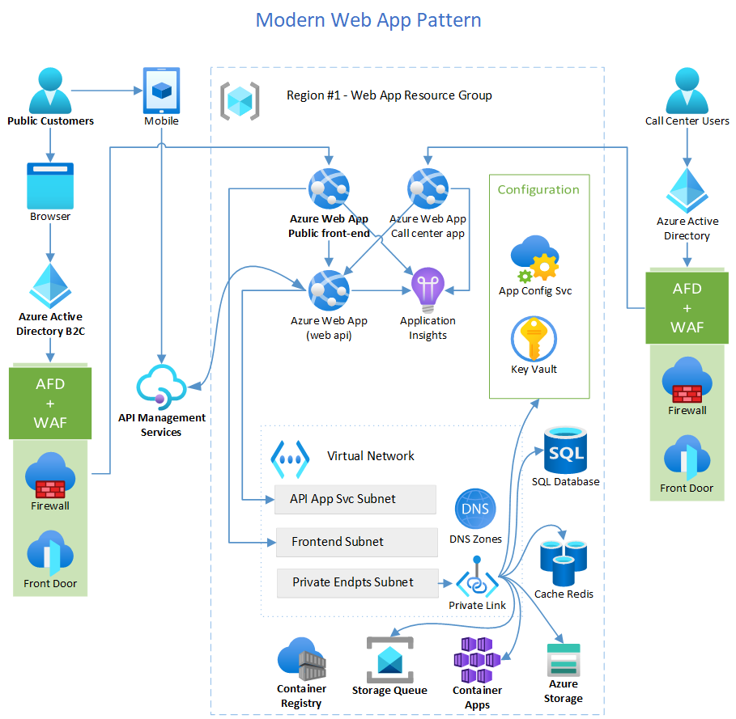

# Modern Web Application

The guidance simulates a common developer journey. It applies the principles of the Well-Architected Framework and Twelve-Factor Applications to migrate and modernize a legacy, line-of-business (LOB) web app to the cloud. The guidance addresses the challenges in refactoring a monolithic ASP.NET application with a Microsoft SQL Server database and developing a modern, reliable, and scalable ASP.NET Core application. We provide recommendations and deployable artifacts with this guidance. The deployable artifacts create a modernized B2C web application that has improved reliability, security, performance, and more mature operational practices at a predictable cost. It provides a foundation upon which you can achieve longer-term objectives.

## Architecture

The diagram depicts the web application solution that you can deploy with the implementation guidance.

## Considerations

The five pillars of the Azure Well-Architected Framework provide guiding tenets that improve the quality of cloud applications.